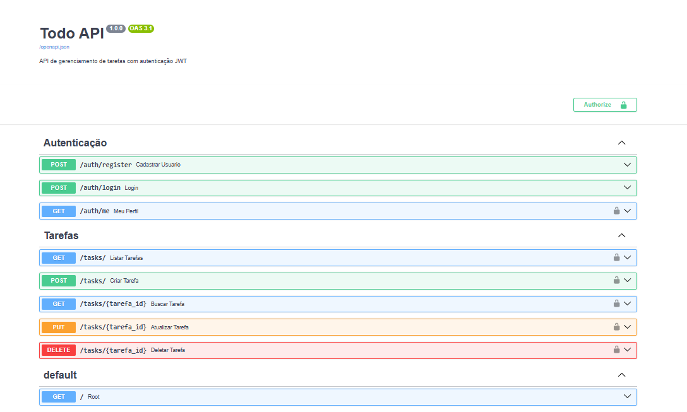
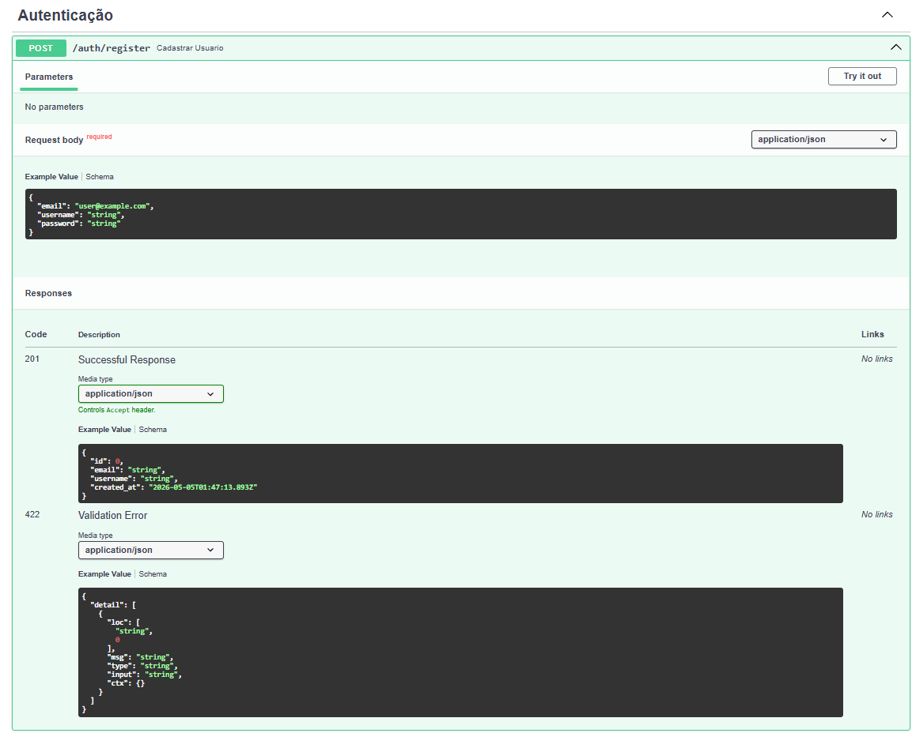
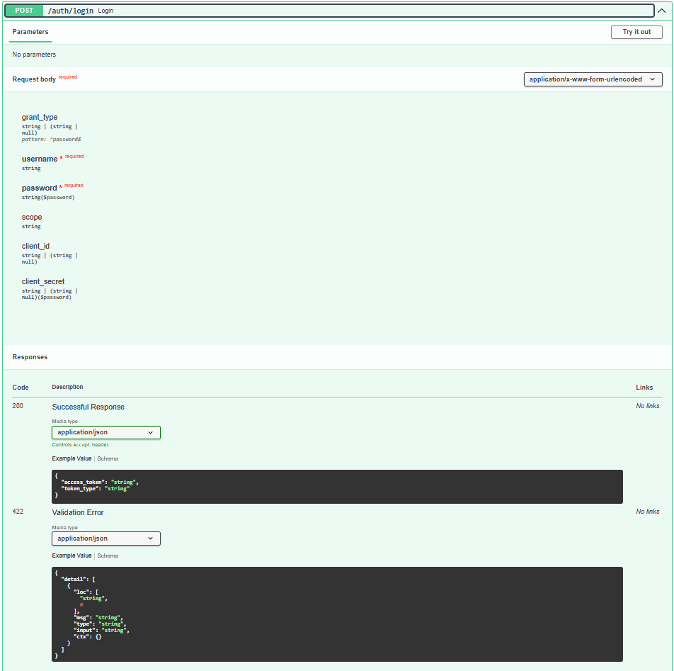
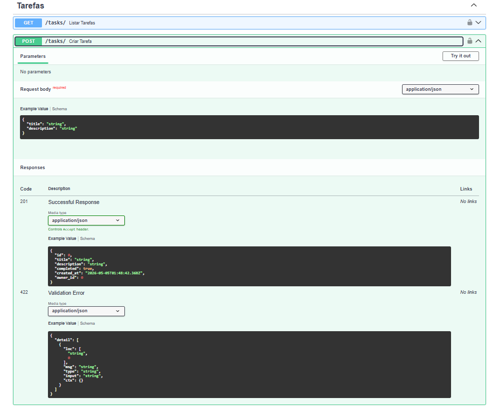

# 📝 Todo API

API REST de gerenciamento de tarefas com autenticação JWT.

Projeto desenvolvido para aprender Python e FastAPI na prática.

## 🌐 API em Produção

A API está disponível publicamente:

👉 **https://todo-api-production-f85b9.up.railway.app/docs**



---

## 🚀 Tecnologias

- Python 3.12
- FastAPI
- SQLAlchemy
- SQLite (local) / PostgreSQL (produção)
- JWT para autenticação
- Deploy no Railway

---

## 📌 Endpoints

### Autenticação

| Método | Rota | Descrição |
|--------|------|-----------|
| POST | `/auth/register` | Cadastrar novo usuário |
| POST | `/auth/login` | Login e geração de token JWT |
| GET | `/auth/me` | Dados do usuário autenticado |

### Tarefas (requer autenticação)

| Método | Rota | Descrição |
|--------|------|-----------|
| POST | `/tasks/` | Criar tarefa |
| GET | `/tasks/` | Listar todas as tarefas |
| GET | `/tasks/{id}` | Buscar tarefa por ID |
| PUT | `/tasks/{id}` | Atualizar tarefa |
| DELETE | `/tasks/{id}` | Deletar tarefa |

---

## 🔐 Como usar a API

### 1. Cadastro


### 2. Login


### 3. Criar tarefa


---

## ⚙️ Como rodar localmente

```bash
# Clone o repositório
git clone https://github.com/isawc/todo-api.git
cd todo-api

# Crie e ative o ambiente virtual
py -3.12 -m venv venv
venv\Scripts\activate

# Instale as dependências
pip install -r requirements.txt

# Rode o servidor
uvicorn app.main:app --reload
```

Acesse: http://localhost:8000/docs

---

## 📁 Estrutura do projeto
todo-api/
├── app/
│   ├── main.py          # Entrada da aplicação
│   ├── database.py      # Configuração do banco
│   ├── models.py        # Models (tabelas)
│   ├── schemas.py       # Schemas Pydantic (validação)
│   ├── auth.py          # Lógica JWT e autenticação
│   └── routers/
│       ├── auth.py      # Rotas de autenticação
│       └── tasks.py     # Rotas de tarefas
├── requirements.txt
└── README.md

---

Desenvolvido por [Isaac Alvarenga](https://github.com/isawc)